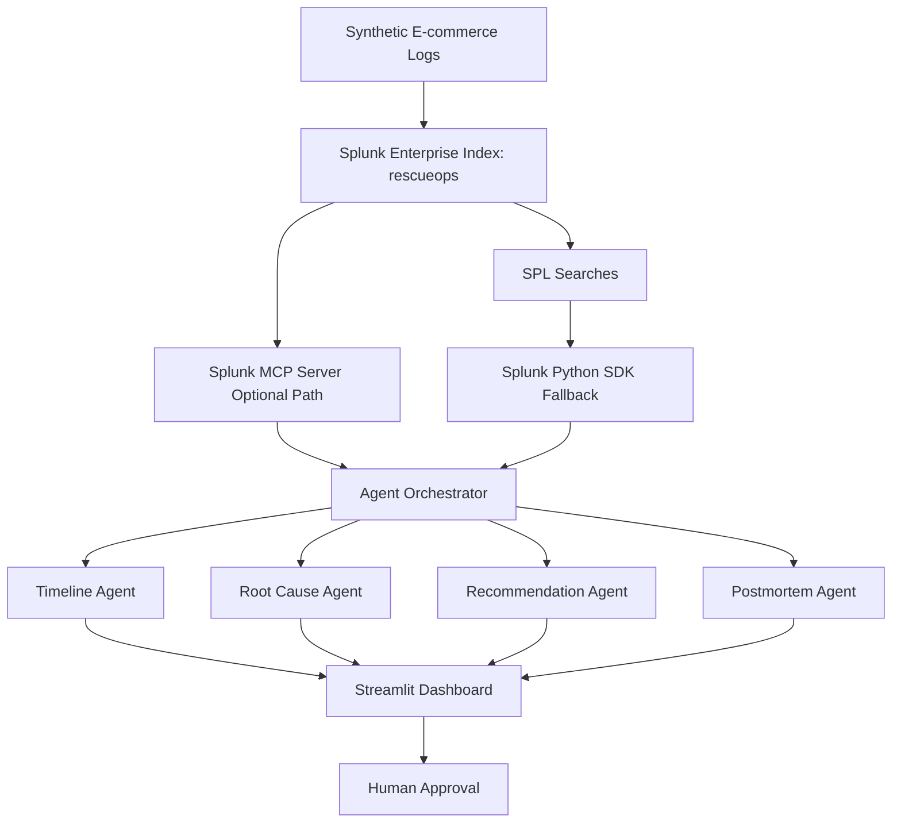

# RescueOps AI Architecture Diagram

## Data Flow

1. Synthetic e-commerce logs are uploaded into Splunk Enterprise.
2. Splunk indexes events in the `rescueops` index.
3. RescueOps AI queries Splunk using SPL through the Python SDK fallback.
4. The agent layer interprets Splunk evidence.
5. The dashboard displays incident summary, timeline, root cause, recommended actions, and a postmortem draft.

## Splunk Integration

- Splunk Enterprise stores and searches operational telemetry.
- SPL queries retrieve incident evidence.
- Splunk Python SDK is used for reliable local execution.
- Splunk MCP Server is the intended secure agent-to-Splunk integration path.

## AI Integration

- Timeline Agent reconstructs the incident sequence.
- Root Cause Agent ranks likely causes.
- Recommendation Agent suggests human-approved mitigations.
- Postmortem Agent generates a structured incident report.
